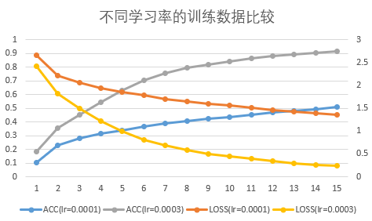
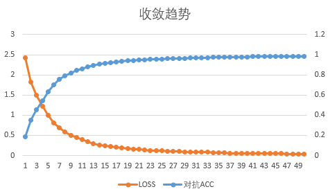

# 论文复现：Towards Deep Learning Models Resistant to Adversarial Attacks

  * [论文复现：Towards Deep Learning Models Resistant to Adversarial Attacks](#论文复现：Towards Deep Learning Models Resistant to Adversarial Attacks)
      * [一、简介](#一、简介)
      * [二、复现精度](#二、复现精度)
      * [三、数据集](#三、数据集)
      * [四、环境依赖](#四、环境依赖)
      * [五、快速开始](#五、快速开始)
         * [step1: 训练](#1、执行以下命令启动训练：)
         * [step2: 评估](#2、执行以下命令进行评估)
      * [六、代码结构与详细说明](#六、代码结构与详细说明)
         * [6.1 代码结构](#6.1-代码结构)
         * [6.2 参数说明](#6.2-参数说明)
         * [6.3 训练流程](#6.3-训练流程)
         * [6.4 测试流程](#6.4-测试流程)
      * [七、实验数据比较及复现心得](#七、实验数据比较及复现心得)
        * [7.1 实验数据比较](#7.1-实验数据比较)
        * [7.2 复现心得](#7.2-复现心得)
      * [八、模型信息](#八、模型信息)

## 一、简介
对抗攻击：攻击者会通过设计一种有针对性的数值型向量从而让机器学习模型做出误判，这被称为对抗性攻击，简单来说就是研究如何生成能使网络出错的样本。

根据条件不同，对抗攻击主要可分为：
- 黑盒攻击与白盒攻击（攻击环境）
黑盒攻击向目标模型提供了不了解该模型而生成的对抗样本(在测试期间)；白盒攻击假定（对抗者）完全了解目标模型，包括其参数值、体系结构、训练方法，在某些情况下还包括其训练数据。
- 有目标攻击和无目标攻击（攻击的目标）
无目标攻击指攻击只要使得网络出错即可，目标攻击则不仅要使得网络出错，而且要指定错误的情况
- 基于梯度的攻击、基于优化的攻击、基于决策面的攻击或者其他（攻击实现方式）

本文从优化角度研究了神经网络的对抗鲁棒性问题，并在某种程度上提出了一种可以抵御任意攻击的思路。

对抗攻击源于神经网络对输入信息的敏感性，当输入信息偏离模型训练样本的分布特征时，网络很可能给出错误的预测值。如果利用此漏洞，对输入信息做精细的改动，则可能导致网络以高置信度给出完全错误的预测。如下图所示，人眼完全无法分辨的差异，会导致网络输出错误结果。
 


本文提出的方法是，首先基于原始样本生成对抗样本，然后再基于对抗样本求解风险期望：


这种Min-Max问题，作者又称之为鞍点问题。Max求解的是，在固定网络参数的情况下，找出原始样本的一个偏移量，使得Loss函数在局部取得最大值，即为求出此时的对抗样本；Min求解的是，在得到对抗样本的情况下，根据梯度下降，使对抗样本的期望风险最小化。

对模型参数寻优，就是用常规的梯度下降法；关键是如何在局部找到原始样本的对抗样本，这个极大值问题。

寻找最优的对抗样本，常用的有两种方法：Fast Gradient Sign Method（FGSM）和Projected Gradient Decent（PGD）方法。

文中有一个有趣的结论是，模型越大，通过本方法获得的效果越好。我原本认为的是，模型对抗攻击鲁棒性差，可能是因为模型复杂导致了过拟合；但文章给出的结论正好相反，作者给出的原因如下图所示。


可以这样理解，文中的方法在客观上等效于随机引入了大量样本参与训练，epsilon邻域越大，参与训练的样本量越大，模型规模也应该同步增加。

论文链接：[Towards Deep Learning Models Resistant to Adversarial Attacks](https://arxiv.org/pdf/1706.06083.pdf)

## 二、复现精度

基于paddlepaddle深度学习框架，对文献算法进行复现后，汇总各测试条件下的测试精度，如下表所示。

|任务|本项目精度|原文献精度|
|----|----|----|
|PGD-steps100-restarts20-sourceA|92.3%|89.3%|
|PGD-steps100-restarts20-sourceA‘|95.9%|95.7%|
|PGD-steps40-restarts1-sourceB|96.6%|96.4%|

超参数配置如下：

|超参数名|设置值|
|----|----|
|lr|0.0003|
|batch_size|128|
|epochs|50|
|alpha|0.01|
|steps|100|
|steps|100/40|
|restarts|20|
|epsilon|0.3|

## 三、数据集
本项目使用的是MNIST数据集。该数据集为美国国家标准与技术研究所（National Institute of Standards and Technology (NIST)）发起整理，一共统计了来自250个不同的人手写数字图片，其中50%是高中生，50%来自人口普查局的工作人员。该数据集的收集目的是希望通过算法，实现对手写数字的识别。

- 数据集大小：
  - MNIST数据集是机器学习领域中非常经典的一个数据集，由60000个训练样本和10000个测试样本组成，每个样本都是一张28 * 28像素的灰度手写数字图片。
- 数据格式：它包含了四个部分
  - （1）Training set images: train-images-idx3-ubyte.gz (9.9 MB, 解压后 47 MB, 包含 60,000 个样本)
  - （2）Training set labels: train-labels-idx1-ubyte.gz (29 KB, 解压后 60 KB, 包含 60,000 个标签)
  - （3）Test set images: t10k-images-idx3-ubyte.gz (1.6 MB, 解压后 7.8 MB, 包含 10,000 个样本)
  - （4）Test set labels: t10k-labels-idx1-ubyte.gz (5KB, 解压后 10 KB, 包含 10,000 个标签)


数据集链接：[MNIST](http://yann.lecun.com/exdb/mnist/)

## 四、环境依赖

- 硬件：
    - x86 cpu
    - NVIDIA GPU
- 框架：
    - PaddlePaddle = 2.1.2

- 其他依赖项：
    - numpy==1.19.3
    - matplotlib==3.3.4

## 五、快速开始

### 1、执行以下命令启动训练：

`python train.py --net robust --seed 0` 

建立robust network，运行完毕后，模型参数文件保存在./checkpoints/MNIST/目录下，手动将该文件保存至./checkpoints/MNIST_Robust_Model目录下。

`python train.py --net robust --seed 10` 建立不同参数的network，用于黑盒攻击A

建立不同参数的network，运行完毕后，模型参数文件保存在./checkpoints/MNIST/目录下，手动将该文件保存至./checkpoints/MNIST_BlackboxA目录下。

`python train.py --net diff_arch --seed 0` 建立不同架构的network，用于黑盒攻击B

建立不同架构的network，运行完毕后，模型参数文件保存在./checkpoints/MNIST/目录下，手动将该文件保存至./checkpoints/MNIST_BlackboxB目录下。

### 2、执行以下命令进行评估

`python test.py --method white --num_restarts 20`
用于白盒测试，对应PGD-steps100-restarts20-sourceA

`python test.py --method blackA --num_restarts 20`
用于网络架构已知，参数未知的黑盒测试，对应PGD-steps100-restarts20-sourceA’

`python test.py --method blackB --num_restarts 1`
用于网络架构未知黑盒测试，对应PGD-steps40-restarts1-sourceB

## 六、代码结构与详细说明
### 6.1 代码结构
```
├─attacks                         # 攻击样本相关
├─config                          # 配置
├─datasets                        # 数据集加载
├─helper                          # 训练、对抗攻击等辅助函数
├─logger                          # 记录log
├─models                          # 模型
├─README.md                       # readme
├─test                            # 测试
├─train                           # 启动训练入口
├─trainer                         # 训练相关类、函数定义
```

### 6.2 参数说明
可以在 `train.py` 中设置训练与评估相关参数，具体如下：

|  参数   | 默认值  | 说明 | 其他 |
|  ----  |  ----  |  ----  |  ----  |
| --dataset-name | 'MNIST', 可选| 选择数据集 ||
| --seed | 0, 可选 | 预训练模型随机数种子 ||
| --net | diff_arch, 可选 | 配置预训练模型架构 |例如：--net ‘robust’ 表示鲁棒性网络，即被攻击网络|

### 6.3 训练流程
可参考快速开始章节中的描述
#### 训练输出
执行训练开始后，将得到类似如下的输出。每一轮`batch`训练将会打印当前已消耗时间、epoch、训练样本的对抗攻击精度、训练样本精度、以及loss值。
```text
Time passed [minutes]: 3.29.     Epoch 1. Train adversarial accuracy: 0.049468.Train accuracy: 0.21,  Train loss:  2.50
```

### 6.4 测试流程
可参考快速开始章节中的描述

此时的输出为：
```
Time passed [minutes]: 0.00.     execution date (d/m/y): 17/08/2021, 18:43:28
Time passed [minutes]: 0.00.     Dataset name: MNIST
Time passed [minutes]: 0.00.     robust model checkpoints folder: .\checkpoints\MNIST_Robust_Model
Time passed [minutes]: 0.00.     blackbox testing model checkpoints folder: .\checkpoints\MNIST_Robust_Model
Time passed [minutes]: 0.00.     PGD parameters: 
Time passed [minutes]: 0.00.     PGD step: [40]    PGD restarts: 20
Time passed [minutes]: 0.00.     testing results folder: .\test_results_folder\MNIST
Time passed [minutes]: 0.00.     execution device: CUDAPlace(0)


Time passed [minutes]: 0.01.     Testing on white box
Time passed [minutes]: 0.05.     Network architecture:
Time passed [minutes]: 0.05.     CNN_MNIST_OriginNet(
  (cnn): Sequential(
    (0): Conv2D(1, 32, kernel_size=[5, 5], padding=2, data_format=NCHW)
    (1): ReLU()
    (2): MaxPool2D(kernel_size=2, stride=2, padding=0)
    (3): Conv2D(32, 64, kernel_size=[5, 5], padding=2, data_format=NCHW)
    (4): ReLU()
    (5): MaxPool2D(kernel_size=2, stride=2, padding=0)
  )
  (lin): Sequential(
    (0): Linear(in_features=3136, out_features=1024, dtype=float32)
    (1): ReLU()
    (2): Linear(in_features=1024, out_features=10, dtype=float32)
  )
)
Time passed [minutes]: 0.05.     load robust network from .\checkpoints\MNIST_Robust_Model\MNIST-ORIGIN-NET with PGD adversarial training.pdparams
Time passed [minutes]: 0.05.     load blackbox network from .\checkpoints\MNIST_Robust_Model\MNIST-ORIGIN-NET with PGD adversarial training.pdparams
Time passed [minutes]: 0.05.     FGMS attack selected hyperparams: {'epsilon': 0.3}
Time passed [minutes]: 0.05.     PGD attack selected hyperparams: {'alpha': 0.01, 'steps': 100, 'epsilon': 0.3}
Time passed [minutes]: 12.45.     TEST SCORES of MNIST-ORIGIN-NET:
Time passed [minutes]: 12.45.     accuracy on test:                         0.9864
Time passed [minutes]: 12.45.     accuracy on FGSM constructed examples:    0.9524
Time passed [minutes]: 12.45.     accuracy on PGD constructed examples:     0.923455
```

## 七、实验数据比较及复现心得
### 7.1 实验数据比较

在不同的超参数配置下，模型的收敛效果、达到的精度指标有较大的差异，以下列举不同超参数配置下，实验结果的差异性，便于比较分析：

（1）学习率：

原文献采用的优化器与本项目一致，为Adam优化器，原文献学习率设置为0.0001，本项目经调参发现，
学习率设置为0.0003能够更快、更好地收敛。不同学习率在训练时，对攻击样本的精度和loss函数如下图所示。



（2）训练时，是否加入原始样本：

根据本项目所参考的
[repo](https://github.com/eldadp100/Towards-Deep-Learning-Models-Resistant-to-Adversarial-Attacks-Implementation)
描述，训练时加入原始样本，有利于模型精度的提高。本项目分别在相同超参数配置下，比较了是否加入原始样本进行训练的实验结果，如下表所示。

|测试项| add origin samples | no original samples |
|---| --- | --- |
| 测试集ACC | 98.86% | 98.56% |
| FGSM攻击ACC | 96.17% | 96.31% |
| PGD攻击ACC | 92.45% | 93.44% |

原文献作者算法，训练时只针对生成的对抗样本，训练时不加入原始样本。通过上表对比数据可知，
增加原始样本，有利于微小提升真实样本的准确率（0.3%），但会导致攻击样本准确率略有下降。

但总体上，对指标影响很小。

（3）initialer：

对模型权重启用不同的初始化方式，会有不同的收敛效果。pytorch默认的参数初始化方式为KaimingNormalize，
而paddle默认的初始化方式为XavierNormalize。本项目对比了两种不同的初始化方式下，模型LOSS函数和ACC指标的收敛情况，
如下图所示。


从图中可以观察到，本项目使用KaimingNormalize初始化方法后，模型的收敛速度更快，最终对抗攻击时给出的精度也更高。

（4）epoch轮次

本项目训练时，采用的epoch轮次为50。LOSS和对抗准确率基本稳定，模型处于收敛状态，如下图所示。



### 7.2 复现心得
本次论文复现，由于论文作者并未给出原始的模型参考实现，仅提供了部分基于TensorFlow的部分代码，复现难度比较大。
前期除了对文献本身研读以外，同时在网上查阅了很多资料，以及同领域的相似实现代码。论文复现过程中，
所学到的领域知识，令我获益匪浅，对对抗攻击方向的研究也有了更深入的理解。

纸上得来终觉浅，绝知此事要躬行。古人诚不欺我！

除了文献本身的理论学习，在项目实现过程中，细致比较了pytorch和paddle框架的实现异同。
譬如，模型的初始化方式，pytorch默认采用kaiming_normal进行初始化；而paddle默认采用Xavier_normal。
对于一般的网络训练，仅仅初始化部分的微小差异通常不会引起大问题，但项目似有不同。

本项目开始使用paddle的默认初始化，即Xavier_normal，通常这种方式在大多数网络下都是最佳的初始化配置方式。但本项目在Xavier_normal初始化后，
网络收敛速度极慢，精度也比较差，迟迟不能达到论文指标。经反复研究比较，改用kaiming_normal后，才真正与pytorch对齐，精度也达到了理想状态。

## 八、模型信息

训练完成后，模型保存在checkpoints目录下。

训练日志保存在results_folder目录下，测试日志保存在test_results_folder目录下。

| 信息 | 说明 |
| --- | --- |
| 发布者 | hrdwsong |
| 时间 | 2021.08 |
| 框架版本 | Paddle 2.1.2 |
| 应用场景 | 对抗训练 |
| 支持硬件 | GPU、CPU |
|Aistudio地址|https://aistudio.baidu.com/aistudio/projectdetail/2289921?shared=1|
