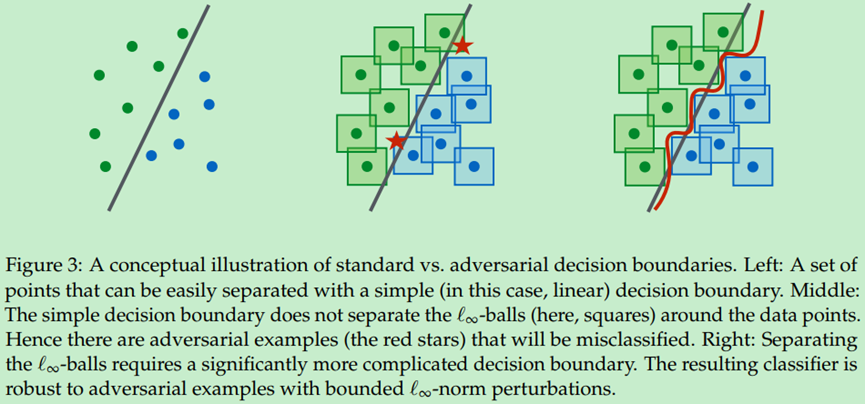

# 论文复现：Towards Deep Learning Models Resistant to Adversarial Attacks

## 一、简介
对抗攻击：攻击者就会通过设计一种有针对性的数值型向量从而让机器学习模型做出误判，这便被称为对抗性攻击，简单来说就是研究如何生成能使网络出错的样本。

根据条件不同，对抗攻击主要可分为：
- 黑盒攻击与白盒攻击（攻击环境）
黑箱攻击向目标模型提供了不了解该模型而生成的对抗样本(在测试期间)；白箱攻击假定（对抗者）完全了解目标模型，包括其参数值、体系结构、训练方法，在某些情况下还包括其训练数据。
- 有目标攻击和无目标攻击（攻击的目标）
无目标攻击指攻击只要使得网络出错即可，目标攻击则不仅要使得网络出错，而且要指定错误的情况
- 基于梯度的攻击、基于优化的攻击、基于决策面的攻击或者其他（攻击实现方式）

本文从优化角度研究了神经网络的对抗鲁棒性问题，并在某种程度上提出了一种可以抵御任意攻击的思路。

对抗攻击源于神经网络对输入信息的敏感性，当输入信息偏离模型训练样本的分布特征时，网络很可能给出错误的预测值。如果利用此漏洞，对输入信息做精细的改动，则可能导致网络以高置信度给出完全错误的预测。如下图所示，人眼完全无法分辨的差异，会导致网络输出错误结果。
 

本文提出的方法是，首先基于原始样本生成对抗样本，然后再基于对抗样本求解风险期望：

这种Min-Max问题，作者又称之为鞍点问题。Max求解的是，在固定网络参数的情况下，找出原始样本的一个偏移量，使得Loss函数在局部取得最大值，即为求出此时的对抗样本；Min求解的是，在得到对抗样本的情况下，根据梯度下降，使对抗样本的期望风险最小化。

对模型参数寻优，就是用常规的梯度下降法；关键是如何在局部找到原始样本的对抗样本，这个极大值问题。

寻找最优的对抗样本，常用的有两种方法：Fast Gradient Sign Method（FGSM）和Projected Gradient Decent（PGD）方法。

文中有一个有趣的结论是，模型越大，通过本方法获得的效果越好。我原本认为的是，模型对抗攻击鲁棒性差，可能是因为模型复杂导致了过拟合；但文章给出的结论正好相反，作者给出的原因如下图所示。

可以这样理解，文中的方法在客观上等效于随机引入了大量样本参与训练，epsilon邻域越大，参与训练的样本量越大，模型规模也应该同步增加。

论文链接：https://arxiv.org/pdf/1706.06083.pdf

## 二、复现精度

基于paddlepaddle深度学习框架，对文献算法进行复现后，汇总各测试条件下的测试精度，如下表所示。

|任务|本项目精度|原文献精度|
|----|----|----|
|PGD-steps100-restarts20-sourceA|92.555%|89.3%|
|PGD-steps100-restarts20-sourceA‘|97.3955%|95.7%|
|PGD-steps40-restarts1-sourceB|97.22%|96.4%|

超参数配置如下：

|超参数名|设置值|
|----|----|
|lr|0.0003|
|batch_size|128|
|epochs|50|
|alpha|0.01|
|steps|100|
|steps|100/40|
|restarts|20|
|epsilon|0.3|

## 三、数据集
本项目使用的是MNIST数据集。

MNIST数据集是机器学习领域中非常经典的一个数据集，由60000个训练样本和10000个测试样本组成，每个样本都是一张28 * 28像素的灰度手写数字图片。

该数据集为美国国家标准与技术研究所（National Institute of Standards and Technology (NIST)）发起整理，一共统计了来自250个不同的人手写数字图片，其中50%是高中生，50%来自人口普查局的工作人员。该数据集的收集目的是希望通过算法，实现对手写数字的识别。

数据集链接：http://yann.lecun.com/exdb/mnist/

## 四、环境依赖

- 硬件：
    - x86 cpu
    - NVIDIA GPU
- 框架：
    - PaddlePaddle = 2.1.2

- 其他依赖项：
    - numpy==1.19.3
    - matplotlib==3.3.4

## 五、快速开始

1、执行以下命令启动训练：

`python train.py --net robust --seed 0` 

建立robust network，运行完毕后，模型参数文件保存在./checkpoints/MNIST/目录下，手动将该文件保存至./checkpoints/MNIST_Robust_Model目录下。

`python train.py --net robust --seed 10` 建立不同参数的network，用于黑盒攻击A

建立不同参数的network，运行完毕后，模型参数文件保存在./checkpoints/MNIST/目录下，手动将该文件保存至./checkpoints/MNIST_BlackboxA目录下。

`python train.py --net diff_arch --seed 0` 建立不同架构的network，用于黑盒攻击B

建立不同架构的network，运行完毕后，模型参数文件保存在./checkpoints/MNIST/目录下，手动将该文件保存至./checkpoints/MNIST_BlackboxB目录下。

2、执行以下命令进行评估

`python test.py --method white --num_restarts 20`
用于白盒测试，对应PGD-steps100-restarts20-sourceA

`python test.py --method blackA --num_restarts 20`
用于网络架构已知，参数未知的黑盒测试，对应PGD-steps100-restarts20-sourceA’

`python test.py --method blackB --num_restarts 1`
用于网络架构未知黑盒测试，对应PGD-steps40-restarts1-sourceB

## 六、模型信息

训练完成后，模型保存在checkpoints目录下。

训练日志保存在results_folder目录下，测试日志保存在test_results_folder目录下。

| 信息 | 说明 |
| --- | --- |
| 发布者 | hrdwsong |
| 时间 | 2021.08 |
| 框架版本 | Paddle 2.1.2 |
| 应用场景 | 对抗训练 |
| 支持硬件 | GPU、CPU |

